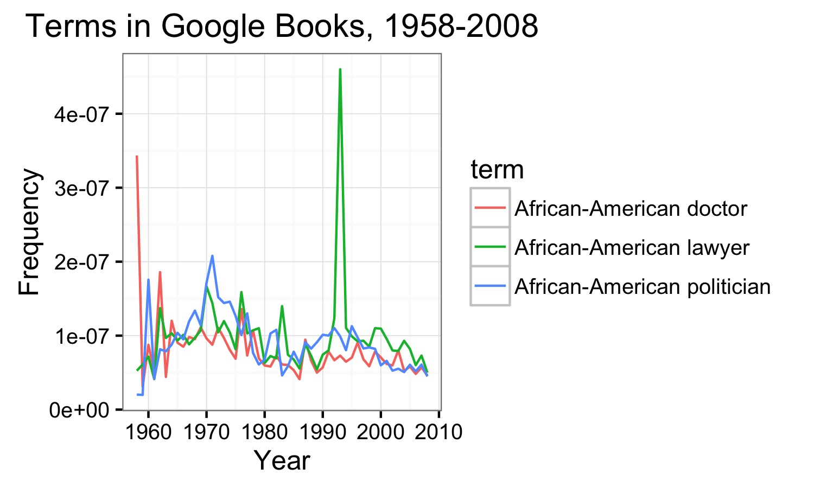
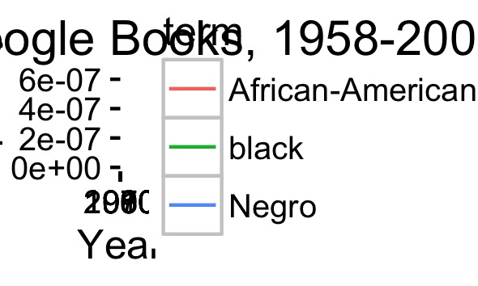

[Google Ngrams](https://books.google.com/ngrams) are a popular way to show how the usage of specific terms has changed over time. 

This package calls Google Ngrams from within R. It has two functions: `ngram()`, which fetches hte data of a basic Google Ngram, and `ngram_group()`, which groups Google's Ngram data for terms that are close variants.  `ngram_group` thus makes it possible to chart joint frequencies in a way that is robust to subtle linguistic shifts over time.

### Ngram

The example below uses the base `ngram()` function. It replicates the plot you get when you visit https://books.google.com/ngrams/.

	library(ggplot2)
	library(tidyr)
	library(dplyr)

	# set query terms
	main.terms <- c("Frankenstein", "Albert Einstein", "Sherlock Holmes")

	# plot by term
	df <- ngram(main.terms, smoothing=3)

	df.plot <- df %>%
	  gather(term, frequency, -year)

	p <- ggplot(df.plot, aes(year, frequency, colour=term)) + geom_line() +
	  ylab("Frequency") +
	  xlab("Year") +
	  ggtitle("Terms in Google Books, 1800-2000") +
	  theme_bw()
	p

### Ngram

The real value of gbNgram is in `ngram_group`. To control for shifts in usage over time, the function returns joint frequencies across a range of terms (and, if specified, their plurals).

Suppose you're a researcher interested in race. The following example shows how different professions have changed over time: 

	# set query terms
	main.terms <- c("doctor", "lawyer", "politician")
	adjs <- c("African-American", "Negro", "black")

	# plot by term
	df <- ngram_group(main.terms, adjs, include.plurals = TRUE,
	                  yr.start = 1958, yr.end = 2008)

	df.plot <- df %>%
	  gather(term, frequency, -year)

	p <- ggplot(df.plot, aes(year, frequency, colour=term)) + geom_line() +
	  ylab("Frequency") +
	  xlab("Year") +
	  ggtitle("Terms in Google Books, 1958-2008") +
	  theme_bw()
	p

Interesting. The professions move in tandem, except for the mid-1990s, when (presumably) the O.J. Simpson trial leads to a spike in references to lawyers.

What the above doesn't show though is how the descriptors of race changed over time. For that, try this: 

	# plot by qualifer
	df <- ngram_group(main.terms, adjs, group.by=2,  include.plurals = TRUE,
	                  yr.start = 1958, yr.end = 2008)

	df.plot <- df %>%
	  gather(term, frequency, -year)

	p <- ggplot(df.plot, aes(year, frequency, colour=term)) + geom_line() +
	  ylab("Frequency") +
	  xlab("Year") +
	  ggtitle("Terms in Google Books, 1958-2008") +
	  theme_bw()
	p

# Installation

Currently the only way to install gbNgram is via `devtools`: 

	library(devtools)

	devtools::install_github(chrismeserole/gbNgram)
