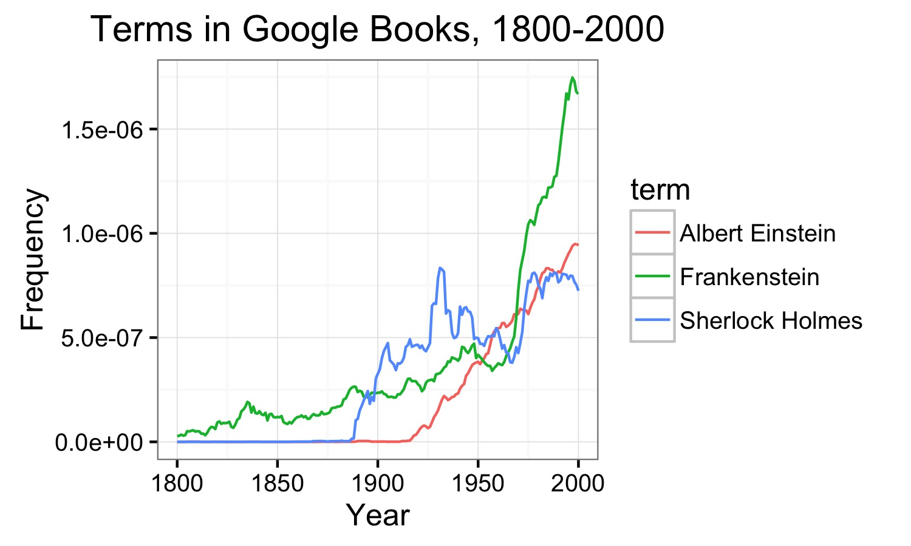

[Google Ngrams](https://books.google.com/ngrams) are a popular way to show how the usage of specific terms has changed over time. 

This package calls Google Ngrams from within R. It has two functions: `ngram()`, which fetches hte data of a basic Google Ngram, and `ngram_group()`, which groups Google's Ngram data for terms that are close variants.  `ngram_group` thus makes it possible to chart joint frequencies in a way that is robust to subtle linguistic shifts over time.

### ngram()

The example below uses the base `ngram()` function. It replicates the plot you get when you visit https://books.google.com/ngrams/.

	library(ggplot2)
	library(tidyr)
	library(dplyr)
	library(gbNgram)

	# set query terms
	main.terms <- c("Frankenstein", "Albert Einstein", "Sherlock Holmes")

	# plot by term
	df <- ngram(main.terms, smoothing=3)

	df.plot <- df %>%
	  gather(term, frequency, -year)

	p <- ggplot(df.plot, aes(year, frequency, colour=term)) + geom_line() +
	  ylab("Frequency") +
	  xlab("Year") +
	  ggtitle("Terms in Google Books, 1800-2000") +
	  theme_bw()
	p

### ngram_group()

The real value of gbNgram is in `ngram_group`. To control for shifts in usage over time, the function returns joint frequencies across a range of terms. 

Suppose you're a researcher interested in how discourse around Muslims has changed over time. The following example shows how different professions have changed over time: 

	main.terms <- c("poet", "historian", "writer")
	adjs <- c("Muslim", "Moslem")

	# plot by term
	df <- ngram_group(main.terms, adjs, 
	                  include.all.cases = TRUE,
	                  include.plurals = TRUE,
	                  yr.start = 1908, yr.end = 2008)

	df.plot <- df %>%
	  gather(term, frequency, -year)

	p <- ggplot(df.plot, aes(year, frequency, colour=term)) + geom_line() +
	  ylab("Frequency") +
	  xlab("Year") +
	  ggtitle("Terms in Google Books, 1908-2008") +
	  theme_bw()
	p

What the line for "Muslim poet" shows is actually a joint frequency. More specifically, it shows how often "Muslim poet", "muslim poet", "Moslem poet" and "moslem poet" appear in a given year -- as well as the plural of each term. 

What the above doesn't show though is how the descriptors of race changed over time. For that, try this: 

	# plot by qualifer
	df <- ngram_group(main.terms, adjs, group.by=2,  
					  include.plurals = TRUE, 
					  include.all.cases = TRUE,
	                  yr.start = 1958, yr.end = 2008)

	df.plot <- df %>%
	  gather(term, frequency, -year)

	p <- ggplot(df.plot, aes(year, frequency, colour=term)) + geom_line() +
	  ylab("Frequency") +
	  xlab("Year") +
	  ggtitle("Terms in Google Books, 1908-2008") +
	  theme_bw()
	p
 

Here the line for "Muslim" shows how often "Muslim poet", "muslim poet", "Muslim historian", "muslim historian",  "Muslim writer" or "muslim writer" appears in a given year -- as well, again, as the plural of each term. 

# Installation

Currently the only way to install gbNgram is via `devtools`: 

	library(devtools)

	devtools::install_github(chrismeserole/gbNgram)
